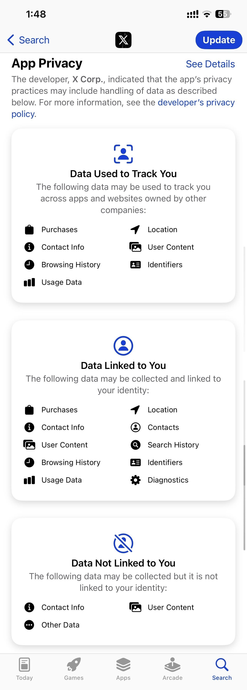
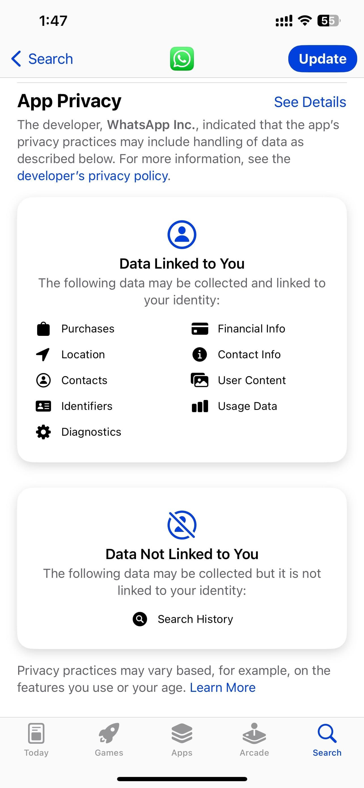
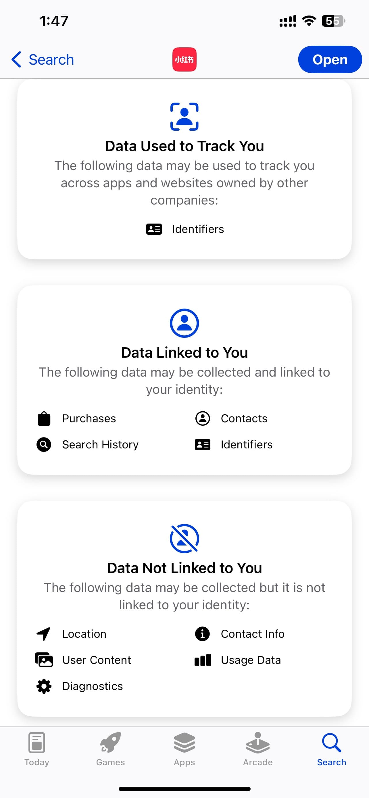

As rednote is a Chinese app, overseas users might naturally have concerns about its privacy practices and data handling policies. How does it compare to apps developed by U.S.-based companies in terms of transparency and safety? 

In this article, we’ll explore rednote’s privacy features, examine what data it collects, and compare it with popular apps from major U.S. companies to determine how secure it really is for users around the globe.

Here are the Privacy Policy that apps have declared on Apple's store. 

| X (Twitter) | WhatsApp | rednote |
|------------| -------- | ------- |
|  |  |  |

To determine which app is the safest from the three screenshots based on their privacy practices, 

<!-- truncate -->

1. **X App**:
   - **Data Used to Track You**: Includes purchases, location, contact info, browsing history, usage data, user content, and identifiers.
   - **Data Linked to You**: Nearly all categories (purchases, location, contacts, etc.) are linked to your identity.
   - **Data Not Linked to You**: Minimal categories (contact info, user content).

2. **WhatsApp**:
   - **Data Linked to You**: Includes purchases, location, contacts, financial info, contact info, user content, usage data, identifiers, and diagnostics.
   - **Data Not Linked to You**: Only search history.
   - No explicit **Data Used to Track You**, which implies no cross-app tracking for advertising.

3. **rednote (Xiaohongshu)**:
   - **Data Used to Track You**: Only identifiers.
   - **Data Linked to You**: Includes purchases, contacts, search history, and identifiers.
   - **Data Not Linked to You**: Includes location, contact info, user content, usage data, and diagnostics.

### Safest Option:
**rednote (Xiaohongshu)** appears to be the safest:
- Tracks the least amount of cross-app data (only identifiers).
- Provides the most categories under **Data Not Linked to You**, reducing the association between collected data and your identity.
- Although data is linked, fewer categories are tied to your identity compared to X or WhatsApp.

**WhatsApp** is safer than X Corp. because it doesn’t track data across apps, but it collects and links more data to your identity.

### Conclusion:
`rednote` > `WhatsApp` > `X` in terms of data privacy and safety.