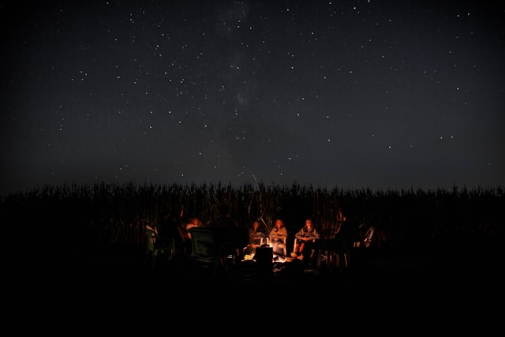

# Connect With The Community

## **Create Your Profile** 

Personalize your profile to make it stand out and feel approachable. Add a photo, a short bio, and a touch of your personality. A well-crafted profile invites others to connect with you and sets the stage for meaningful interactions.  

## **[Pay Your Cat Tax](/docs/pay-your-cat-tax/)**  
   
Participate in the community’s signature tradition by sharing a picture of your pet — or, if you don’t have one, post something meaningful to you, like a hobby or a beautiful view from your hometown. It’s a fun way to make a memorable first impression and start engaging with the community.  

## **Engage with Posts**  
   
Explore the feed and interact with content shared by other members. Like, comment, and share posts that resonate with you. This not only helps you become more visible but also fosters genuine connections. Don’t worry — rednote’s community is known for being friendly and welcoming!  

## **Post and Interact Regularly**  

Share glimpses of your daily life, thoughts, or creative content. Consistency keeps your profile active and helps others get to know you better. Remember to interact with comments on your posts to build stronger relationships.  Take the initiative to ask questions, share stories, or comment thoughtfully. People value authentic engagement and are likely to respond positively to genuine interactions.  

## **Respect Cultural Norms**  

Be mindful of the cultural roots and dynamics of the community. Engage with genuine curiosity and respect. If you receive unexpected responses or encounter something unfamiliar, don’t hesitate to ask. The community is welcoming, and often members who understand English and cultural differences are ready to help explain and guide you.  

## **Find Common Ground and Agree to Disagree**  

The rednote community stands out from other social platforms by embracing the everyday moments and thoughts of ordinary people. Topics like military and politics are less prominent here, as the platform is designed to focus on sharing personal stories, hobbies, and daily life rather than divisive debates. When asking questions, ensure they are phrased in a friendly and respectful manner. This helps others see your intent as genuine curiosity rather than an attempt to spark controversy or gain attention through heated discussions.  

## **Be Patient and Persistent**  

Your first post might not go viral, but **rednote’s recommendation system ensures that everyone has the chance to shine — not just users with thousands of followers**. As long as your content is creative and interesting, it will have opportunities to be featured. Building connections takes time, so keep participating and contributing. Over time, you’ll naturally become a valued member of the rednote community.  

## And...

**No matter how different we may seem, we share far more in common as humankind.**

> Photo by <a href="https://unsplash.com/@kjerdvig?utm_content=creditCopyText&utm_medium=referral&utm_source=unsplash">Kevin Erdvig</a> on <a href="https://unsplash.com/photos/camping-under-black-sky-k7fUP9RQj3Y?utm_content=creditCopyText&utm_medium=referral&utm_source=unsplash">Unsplash</a>
      