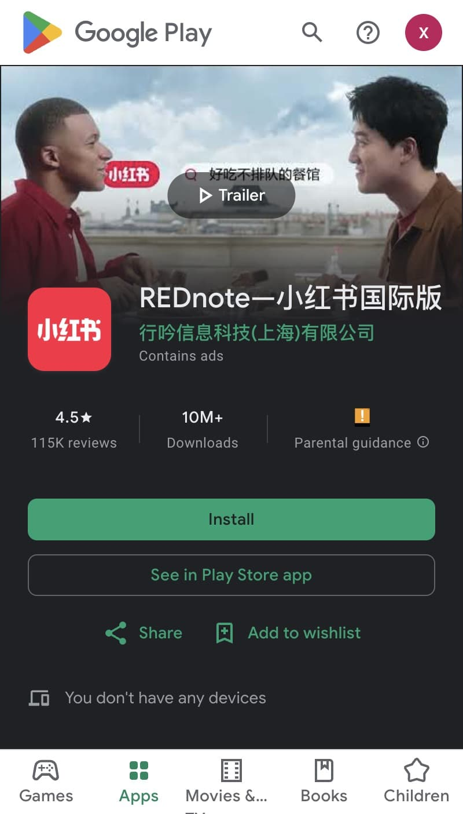
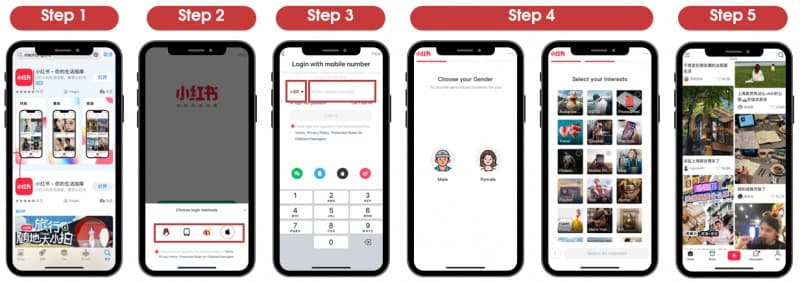

# Tutorial Intro

Hey! Let's Learn **Rednote Basics** in less than 5 minutes.

## Getting Started

### What you'll need

- iPhone, or Android Phone. 
- a Phone number to receive SMS message.

## Download

First, download the app on your devices. 

| Platform | iOS | Android |
| -------- | --- | ------- |
| |  |  |
| Link |  [Download from App store](https://apps.apple.com/us/app/%E5%B0%8F%E7%BA%A2%E4%B9%A6/id741292507) | [Download from Android - Google Play](https://play.google.com/store/apps/details?id=com.xingin.xhs&hl=en_GB&pli=1) |

> 💡 Tips: Rednote does offer MacBook Desktop and Web version app now. However, as the initial step you need a mobile app to start, and later you can scan the QR code from your mobile phone to login the desktop or the web version.

## Register

1. Log in using your phone number or Apple ID. We recommend logging in with your phone number.
2. Select your Country/Region and enter your phone number. A verification code will be sent to you via SMS.
3. Set your gender.  💡 *Yes, in Rednote, there are only TWO gender options to choose from.*
4. Set your interests. Your chosen interests will influence your account's initial positioning.

Your personal account is now registered successfully — start exploring and browsing!

Overall, the steps are as follows,

