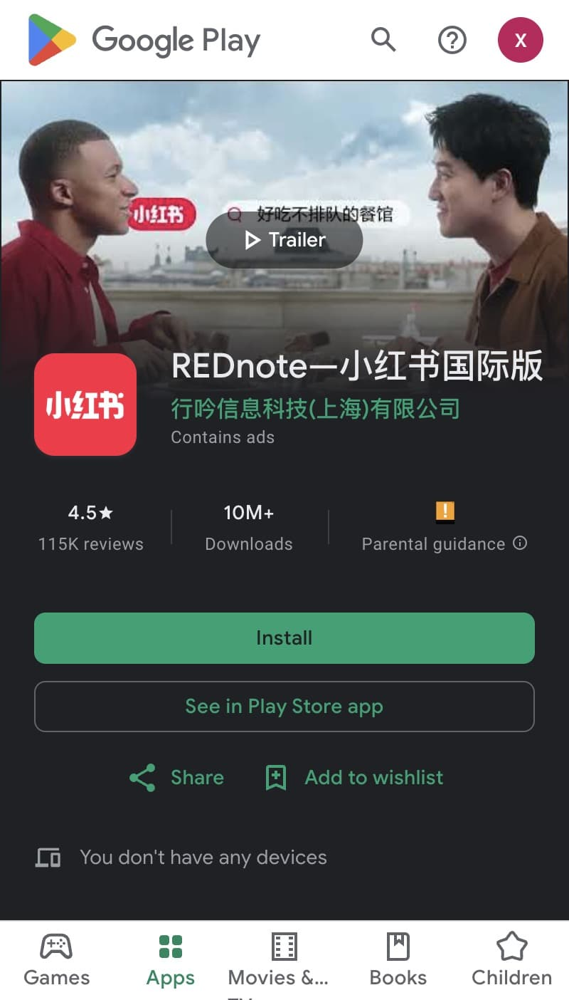
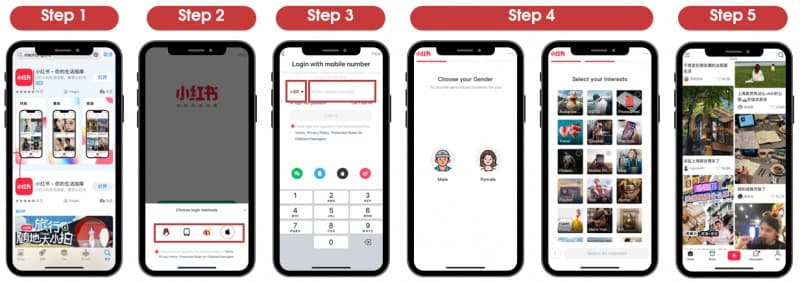
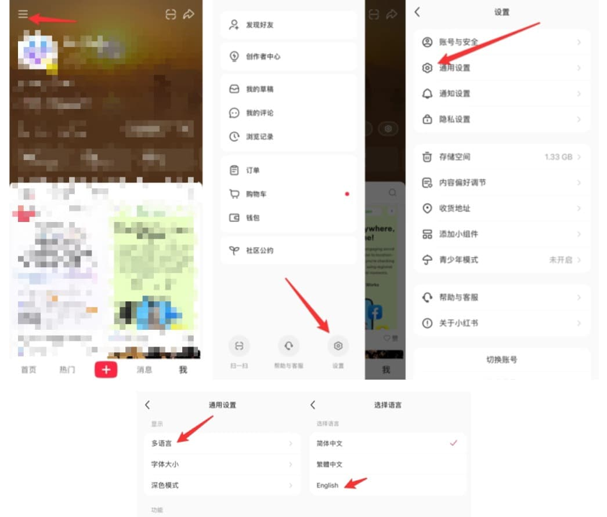

# Getting rednote On Your Phone

## Getting Started

### What You'll Need

- iPhone, or Android Phone. 
- a Phone number to receive SMS message.

## How To Download

First, download the app on your devices. 

| Platform | iOS | Android |
| -------- | --- | ------- |
| |  |  |
| Link |  [Download from App store](https://apps.apple.com/us/app/%E5%B0%8F%E7%BA%A2%E4%B9%A6/id741292507) | [Download from Android - Google Play](https://play.google.com/store/apps/details?id=com.xingin.xhs&hl=en_GB&pli=1) |

:::tip Tips
rednote does offer MacBook Desktop and Web version app now. However, as the initial step you need a mobile app to start, and later you can scan the QR code from your mobile phone to login the desktop or the web version.
:::

## How To Register

1. Log in using your phone number or Apple ID. We recommend logging in with your phone number.
2. Select your Country/Region and enter your phone number. A verification code will be sent to you via SMS.
3. Select your gender.

   :::tip
   Yes, in rednote, just like in majority of Chinese apps, there are two gender options to choose from.
   :::
4. Set your interests. Your chosen interests will influence your account's initial positioning.

Your personal account is now registered successfully — start exploring and browsing!

Overall, the steps are as follows,

## How to Change Language 

It's likely that your rednote app interface selects `Chinese` as the default language, and you can change it to English with a few taps.

:::tip
rednote only supports Simplied Chinese, Traditional Chinese and English for the moment.
:::

1. Open rednote and tap the `Menu` icon (three horizontal lines) in the top left corner.
2. In the side menu, locate and tap the `Settings` button (⚙ 设置).
3. Tap the `General Settings` option (⚙ 通用设置).
4. Tap `Multiple Languages` option (多语言).
5. Choose `English`.

## That's it 

That's it. Happy rednote journey!