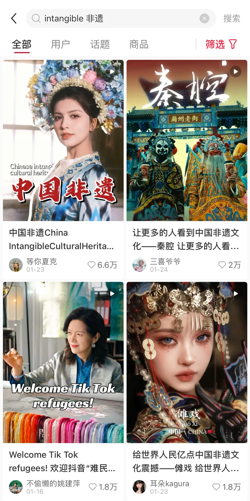
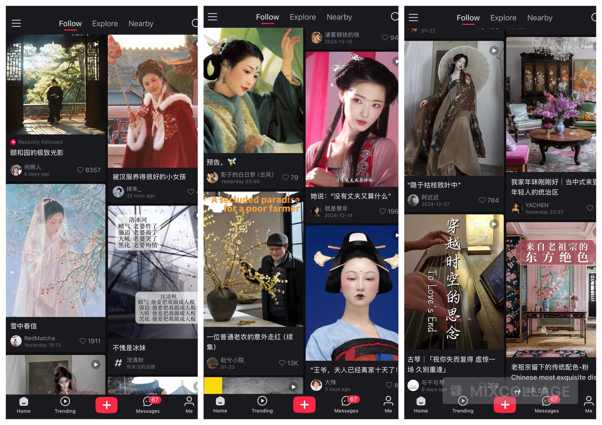

# Use Keywords to Customize Feed

You can customize your feed by using keywords. The rednote algorithm will recommend content that matches your interests. 

For example, if you are interested in `traditional Chinese culture`, you can use keywords related to traditional Chinese culture to customize your feed. Here are some keywords you can use:

- 非遗 intangible
- 非遗文化 intangible cultural heritage
- 汉服 hanfu
- 国风 national style
- 古风 ancient style
- 中式美学 Chinese aesthetics
- 极致的东方美学 eastern aesthetics
- 文物 cultural artifacts
- 传统文化 traditional culture
- 古琴 guqin
- 复原妆造 historical fashion recreation
- 古典舞 ancient dance
- 古建筑 ancient architecture
- 国画 traditional painting
- 插花 floral arrangement
- 书法 calligraphy
- 戏曲 opera
- 民乐 folk music

### Example: searching "intangible"

### What your feed will look like

Copy the above tags, paste into the search box, and when the algorithm picks up your preference, your page will look something like this:

### Discover more

Do you need more keyword pairs to customise your interest?

